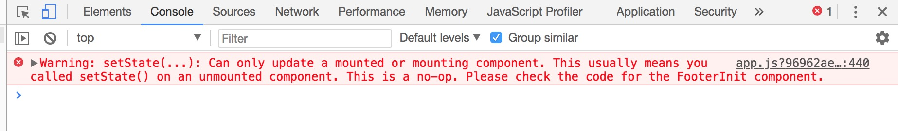
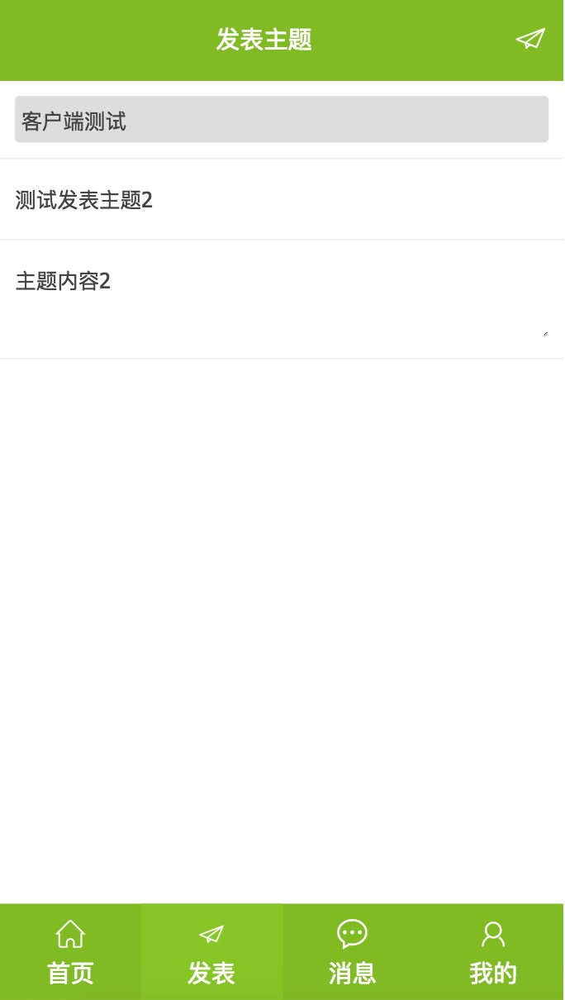

## react-cnode
基于webpack + react + react-router + redux + less + ES6 的React版cnode社区
## 项目运行
- 开发： npm run server  
- 生产： npm run build
## 
## Note  
1. **webpack-dev-server搭建环境（开发／生产），proxy实现访问cnode社区的接口请求**      
[cnode-API](https://cnodejs.org/api)
2. **tab切换选中**   
头部和底部tab切换原来用的redux方式，因为用store控制选中状态当重新刷新页面,store就初始化了，后来改为router方式控制选项卡切换
3. **React router 4 does not update view on link, but does on refresh**    [https://stackoverflow.com/questions/43895805/react-router-4-does-not-update-view-on-link-but-does-on-refresh/44565602]
4. **react-router v4 使用 history 控制路由跳转**  
找不到history的时候试试withRouter吧~~  
https://github.com/brickspert/blog/issues/3
5. **Warning: Can only update a mounted or mounting component**

 

[React异步请求数据出现setState(...): Can only update a mounted or mounting component...](https://www.jianshu.com/p/a9d1f5aa719a )  

[这个错误是什么问题呢This usually means you called setState() on an unmounted component](http://react-china.org/t/this-usually-means-you-called-setstate-on-an-unmounted-component/7397/12)  

[isMounted is an Antipattern
](https://doc.react-china.org/blog/2015/12/16/ismounted-antipattern.html)

6. **发表主题部分**  



用state传来传去有点麻烦，用的redux，也刚好练习练习redux,想的是公用组件，多个组件共用数据的情况就可以用redux；但是redux貌似都是存状态（网页的dark和light模式等等），可能不太恰当吧；先不改了；

7. [Where to Fetch Data: componentWillMount vs componentDidMount](https://daveceddia.com/where-fetch-data-componentwillmount-vs-componentdidmount/)

8. **使用react-redux的时候，是每个需要store数据的组件都去connect一次，还是在顶层组件connect一次?**  
如果是顶层组件connect一次，那么有个问题就是，每次更新公用组件的时候，整个页面都会刷新?....  
这里没有把组件放在connect（可以参考[react-cnode](https://github.com/lzxb/react-cnode)），是分别再各个组件使用的。  

9. **react中获取dom**

    html中添加ref
    ```html
    <div className="box" ref="wrapper"></div>
    ```
    js中利用this.refs获取
    ```js
    const wrapper = this.refs.wrapper;
    ```

10. **部署到GitHub pages**
步骤：
-  npm install gh-pages --save-dev
- 修改package.json
    -   "homepage":"https://oheart.github.io/react-cnode"
    -   "predeploy": "npm run build",
        "deploy": "gh-pages -d dist"
    - 运行npm run build 和 npm run deploy

11. **开发和生产环境请求不同的根路径设置**
让接口请求在开发环境和生产环境都能请求到，通过utils里的config.js文件，然后在service里引入加在请求的url之前。 

config.js文件：
```js
export const target = process.env.NODE_ENV !== 'production' ? '' : 'https://cnodejs.org'; //目标网站
```
service.js文件
```js
import {target} from './config'

let Service = {
  BaseURL: target + '/api/v1'
}
```


## 参考链接
[react-cnode](https://github.com/lzxb/react-cnode)

